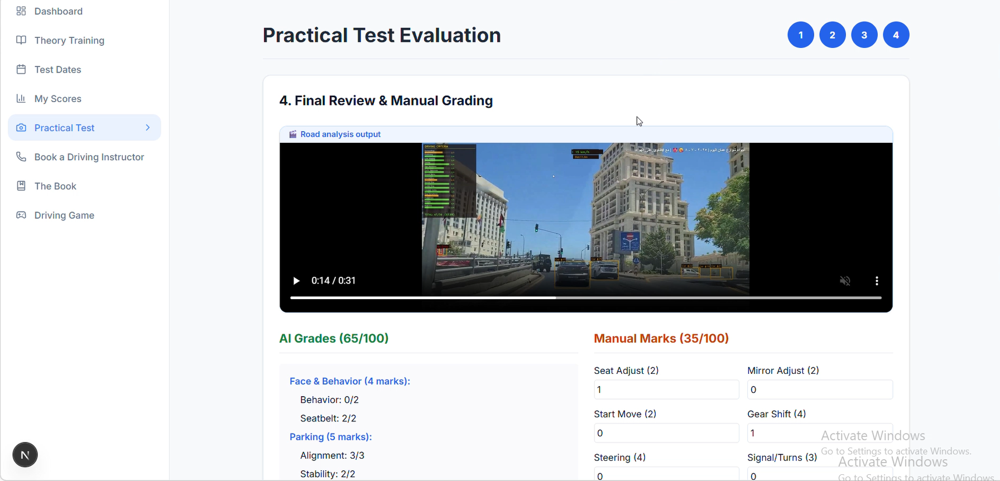
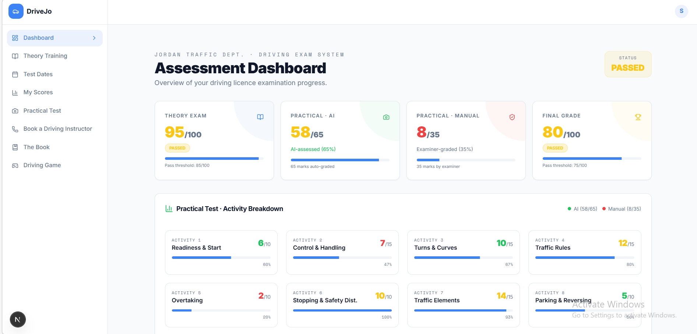
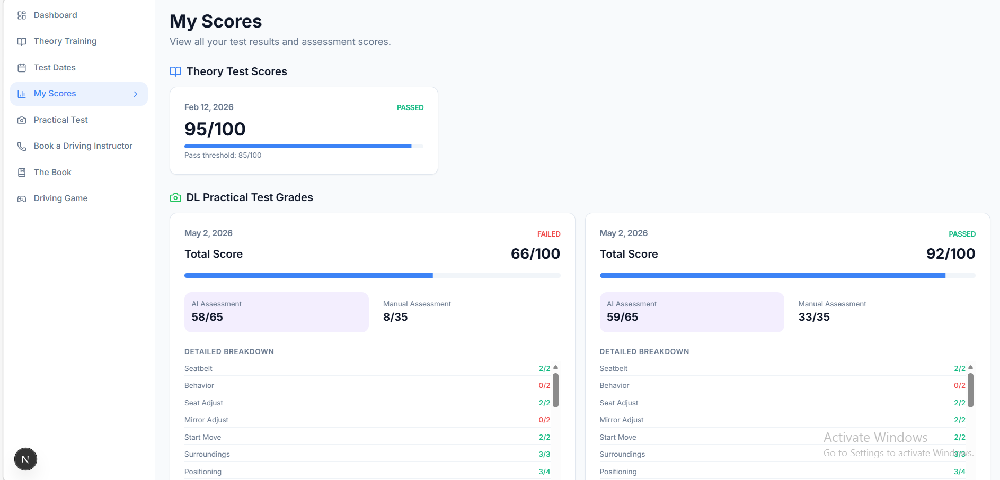
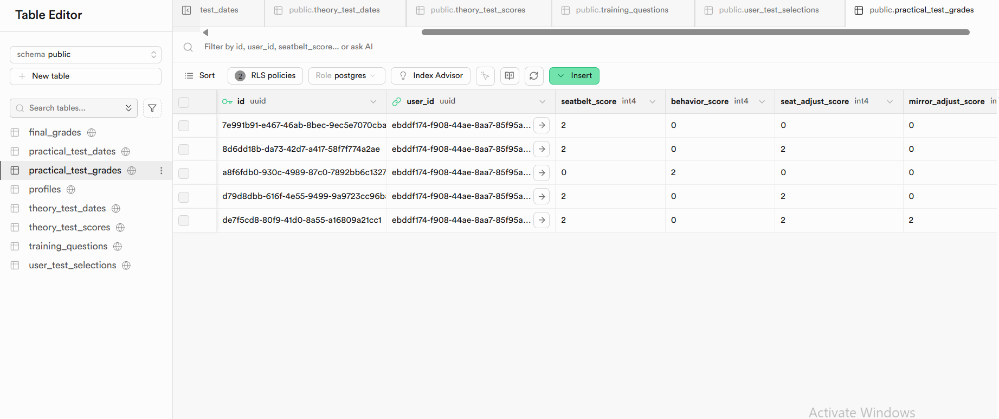
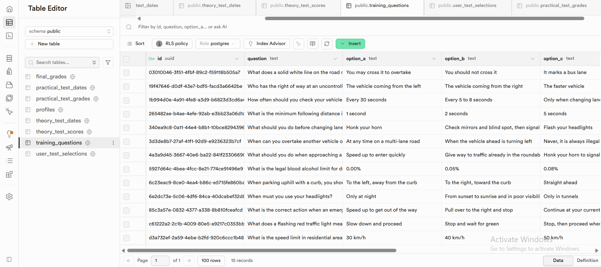

# Comprehensive Technical Report
## AI-Integrated Practical Driving Evaluation System
**Prepared for: Jordan Traffic Department**

---

## 1. Executive Summary

This report details the architecture, functionality, and evaluation methodology of an advanced practical driving test system developed for the Jordan Traffic Department. The platform fundamentally transforms the traditional driving examination by replacing subjective human assessment with a hybrid grading model. 

The system allocates a total of 100 marks, divided into a 65% automated AI assessment and a 35% manual examiner assessment. By leveraging computer vision, optical flow physics, and deep learning models, the system objectively evaluates 16 distinct driving criteria across 8 activity sections. The primary objective is to eliminate human bias, ensure absolute transparency, and provide an immutable, auditable trail of the candidate's driving behavior.

---

## 2. System Architecture Overview

The solution is built on a modern, decoupled three-tier architecture designed for high availability and secure data handling:

*   **Presentation Tier (Frontend):** A server-side rendered web application utilizing Next.js and React. It provides a seamless, wizard-like interface for video submission and manual grading, alongside a comprehensive analytics dashboard.
*   **Backend & Database Tier:** Hosted on Supabase, providing PostgreSQL for relational data storage, Row Level Security (RLS) for access control, and seamless authentication flows.
*   **AI Processing Tier:** Three specialized machine learning models hosted on Hugging Face Spaces. The frontend communicates with these models via a resilient API client capable of handling cloud infrastructure cold-starts gracefully.

---

## 3. Data Engineering & Database Design

The core of the system's reliability lies in its robust database schema, specifically designed to store granular evaluation metrics while maintaining strict data integrity.

### Granular Metric Storage
Instead of storing a single final score, the database captures 33 individual micro-skills. This includes AI-generated metrics (e.g., lane keeping precision, pedestrian reaction time) and examiner-inputted metrics (e.g., mirror adjustment, gear shifting smoothness).

### Audit Trail Mechanism
To ensure absolute transparency and allow for future dispute resolution, the system stores the complete, unedited JSON responses returned by all three AI models in dedicated binary JSON columns. This means the exact state of the AI's analysis at the time of the test is permanently archived.

### Data Integrity Constraints
The database implements rigorous check constraints at the schema level. For every single metric column, a hard limit is enforced (e.g., a specific column cannot exceed 4 marks, another cannot drop below 0 or exceed 2). This prevents database corruption from application-level bugs or manual tampering. Furthermore, a total score constraint ensures the final grade never exceeds 100.

---

## 4. User Interface & Workflow Logic

The frontend is engineered to guide the examiner and candidate through a strict, controlled evaluation pipeline.

### Temporal Access Control
The system does not allow ad-hoc test submissions. The backend verifies the user's authentication, confirms they have passed the theory exam, and critically, checks the exact current time against their pre-booked practical test slot. If the user is not within the precise start and end time window of their appointment, the system denies access to the submission portal.

### The 4-Step Evaluation Wizard
The practical test is broken down into a sequential four-step process to ensure no evaluation phase is skipped:
1.  **Facial & Behavior Analysis:** Captures the driver's face to evaluate seatbelt usage and distracted driving behaviors.
2.  **Parking Assessment:** Captures an exterior view of the vehicle maneuvering into a designated parking space.
3.  **Road Driving Evaluation:** Captures a continuous forward-facing video of the vehicle navigating public roads.
4.  **Manual Review & Submission:** Displays the aggregated AI scores alongside input fields for the 13 manual criteria that require human observation, culminating in a final submission button.

### Analytics Dashboard
Upon completion, users are redirected to a highly visual dashboard. It features four primary score cards (Theory, Practical AI, Practical Manual, Final Grade), broken down by 8 distinct driving activity sections (e.g., "Readiness & Start," "Traffic Rules," "Overtaking") using color-coded progress bars to instantly highlight areas of competency or deficiency.

---

## 5. Artificial Intelligence Engine

The AI engine consists of three distinct models, each optimized for a specific driving domain. 

### 5.1 Behavior & Seatbelt Model (4 Marks)
This model analyzes the interior camera feed to monitor driver conduct. 
*   **Behavior Classification:** It uses an object detection model trained to identify 13 distinct states, ranging from safe driving to hazardous actions like texting, operating the radio, or nodding off. To optimize processing, it samples the video at 60-second intervals rather than analyzing every frame.
*   **Seatbelt Verification:** Utilizes a deep learning classifier enhanced with Test-Time Augmentation (TTA). It flips and adjusts the contrast of the image before making a prediction, significantly increasing accuracy. It samples the video every 180 seconds to confirm continuous compliance.

### 5.2 Parking Evaluation Model (5 Marks)
This model assesses the precision of the parking maneuver.
*   **Geometric Analysis:** It identifies the boundaries of the parking space (using traffic cones) and tracks the vehicle's bounding box. It calculates an "alignment score" based on the percentage of time the vehicle's center point remains within the geometric boundaries defined by the cones.
*   **Stability Assessment:** It tracks the movement of the vehicle's center point across frames. If the vehicle remains virtually motionless (indicating a smooth stop without rolling back or forward), it awards maximum stability points. The model is heavily optimized using frame-skipping and image downscaling to ensure rapid processing.

### 5.3 Road Environment Model (56 Marks)
This is the most computationally intensive and sophisticated model, acting as a virtual driving examiner.
*   **Physics Estimation (Speed & Distance):** Instead of relying on vehicle telemetry (which can be manipulated), it calculates speed using Optical Flow algorithms to track the movement of road features between frames. This raw data is then smoothed using a Kalman Filter to prevent erratic speed jumps. Distance to forward vehicles is estimated using perspective geometry based on the vehicle's vertical position in the frame.
*   **Lane Detection & Road Classification:** Utilizes a deep learning lane detection model to map the vehicle's position within the lane. It calculates the exact deviation from the center line, the curvature of the road, and classifies the road type (straight, slight curve, sharp turn, or intersection) based on historical lane data.
*   **Strict False-Positive Filtering:** To prevent unfair penalties, the system applies aggressive validation. For example, it will not register a "stop sign" detection unless it verifies that the color composition within the bounding box contains a specific percentage of red pixels. Similarly, it rejects "pedestrian" detections if the aspect ratio is wrong or if the object is located in the upper corners of the frame (where billboards or decorations often trigger false alarms).
*   **Dynamic Scoring Buckets:** The system does not use static pass/fail thresholds. Instead, every criteria has a "score bucket" that starts at 75% capacity. Good driving behavior causes the score to smoothly drift upward toward a 95% ceiling, while violations cause immediate, weighted drops with built-in cooldown timers to prevent penalizing a single mistake multiple times.
*   **Contextual Awareness:** The AI understands context. For instance, a sudden hard brake is normally penalized heavily, but if the system simultaneously detects a pedestrian stepping into the road or a red traffic light, the hard brake is registered as a positive "safe reaction" instead of a violation.
*   **Adaptive Processing:** To handle videos of varying lengths (from 1 minute to 30 minutes), the model dynamically adjusts its frame-skipping rate, processing fewer frames per second on longer videos to maintain sub-minute response times without sacrificing accuracy.

---

## 6. Evaluation Methodology & Grading Logic

The final 100 marks are calculated through a precise aggregation of the AI and Manual inputs:

*   **Automated Intelligence (65 Marks):**
    *   Face/Behavior: 4 Marks (Seatbelt, Conduct)
    *   Parking: 5 Marks (Alignment, Stability)
    *   Road Environment: 56 Marks (Distributed across 16 criteria including surroundings, positioning, lane keeping, turning, traffic awareness, pedestrian interaction, and speed management).
*   **Manual Examiner (35 Marks):**
    *   Evaluated across 13 criteria that require human judgment or physical observation outside the camera's view, such as seat adjustment, mirror calibration, initial vehicle start, manual gear shifting, steering technique, indicator usage, overtaking execution, and reverse monitoring.
*   **Pass/Fail Threshold:** A minimum score of 75 out of 100 is required to pass the practical examination.

---

## 7. Security, Access Control, & Data Integrity

The system implements enterprise-grade security measures:
*   **Server-Side Authentication:** All data fetching and test initialization are handled on the server side, preventing client-side tampering with user credentials or test statuses.
*   **Temporal Authorization:** Access to the exam submission interface is cryptographically tied to the specific time window of the booked appointment.
*   **Cascade Deletion:** The database is configured so that if a user's account is deleted, all associated test grades, raw AI data, and session information are automatically purged, ensuring compliance with data privacy regulations.
*   **Indexing:** Strategic database indexing on user identifiers ensures that dashboard loading and score retrieval remain instantaneous regardless of database size.

---

## 8. Conclusion & Future Recommendations

The deployed system represents a significant leap forward in objective driving assessment. By successfully merging real-time computer vision physics with structured human evaluation, it provides the Jordan Traffic Department with an unimpeachable standard for issuing driver's licenses.

**Recommended Future Enhancements:**
1.  **Examiner Biometric Login:** Implement a secondary authentication layer for the manual grading phase to cryptographically link the 35 manual marks to the specific examining officer.
2.  **Edge Computing Integration:** Migrate the AI models to local edge servers within the testing facility to eliminate dependency on external cloud availability and internet latency.
3.  **Predictive Analytics:** Utilize the archived raw JSON data to train predictive models that can identify common failure patterns across the population, allowing the traffic department to adjust its theoretical training curriculums proactively.

## Project Preview

