# DriveSkills — AI-Based Driving License Examination System

An AI-powered web platform that supports practical driving license examinations in Jordan by combining computer vision-based video analysis with human examiner input. Built as a graduation project for the Data Science & Artificial Intelligence program at Yarmouk University.

---

## 📖 Overview

Traditional practical driving exams rely entirely on a human examiner's real-time observation, which can be affected by subjectivity, fatigue, and limited observation time. **DriveSkills** addresses this by using three specialized AI models to analyze driving-test videos and generate structured, evidence-based scores — while keeping the examiner in control of the final decision.

The system evaluates the practical exam out of **100 marks**:

| Evaluation Source      | Purpose                                  |   Marks |
| ---------------------- | ---------------------------------------- | ------: |
| Road Analysis API      | Road driving behavior across 16 criteria |      56 |
| Parking Evaluation API | Parking alignment and stability          |       5 |
| Driver Monitoring API  | Driver behavior and seatbelt usage       |       4 |
| Manual Examiner Entry  | Human judgment criteria                  |      35 |
| **Total**              |                                          | **100** |

**AI contributes 65% of the final score; the examiner contributes the remaining 35%.**

---

## ✨ Features

* Secure authentication and role-based dashboard
* Video upload for road driving, parking, and driver monitoring
* Three independent AI APIs for automated video analysis
* Transparent score breakdown
* Educational Driving Game
* Chatbot Assistant for platform guidance
* Theory Driving Instructors section
* Practical driving exam evaluation
* AI-assisted scoring with human examiner input

---

## 🖥️ Website

<div align="center">
  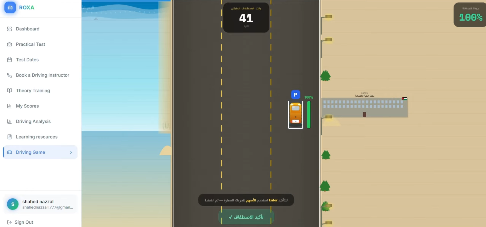
  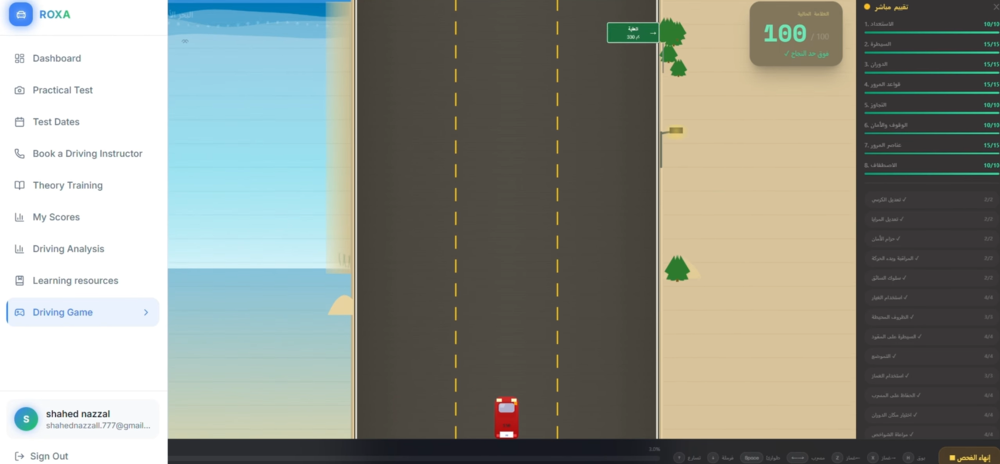
  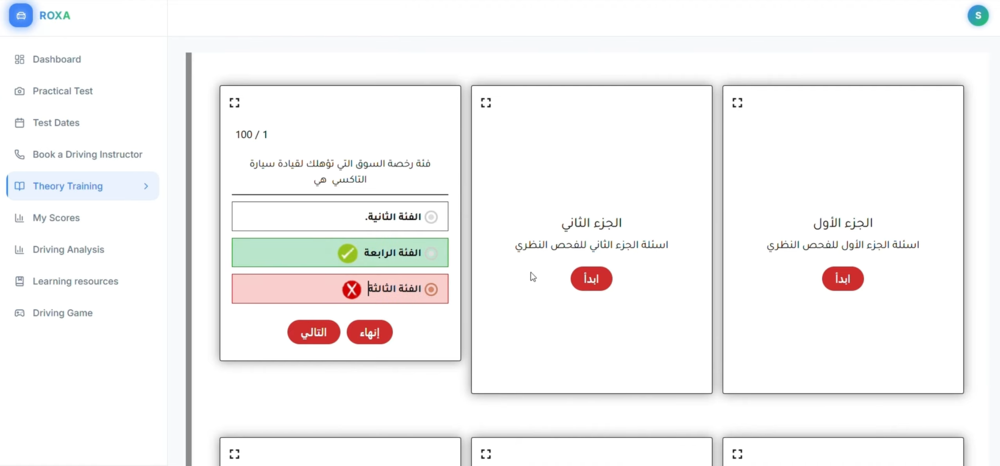
</div>

<div align="center">
  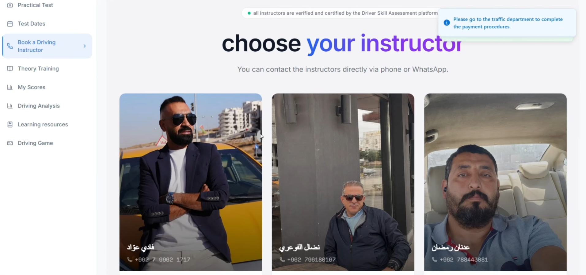
  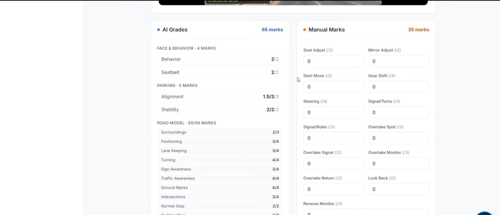
  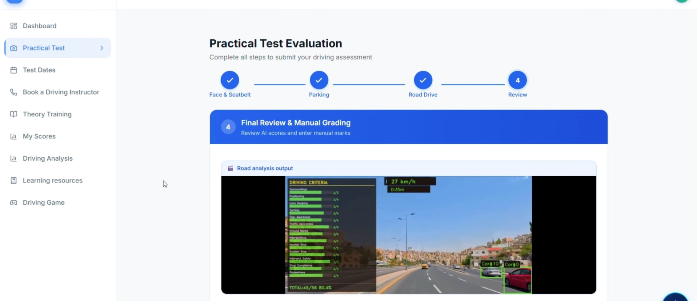
</div>

<div align="center">
  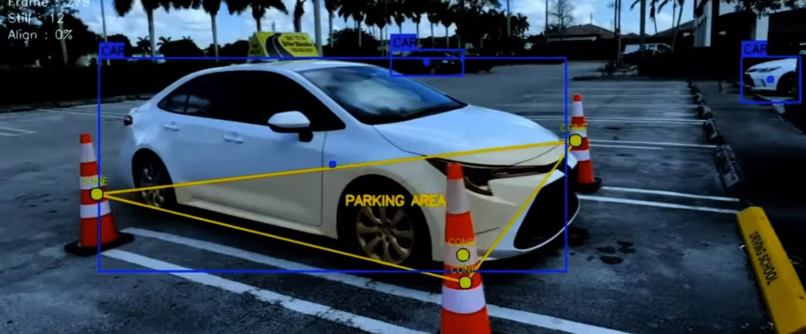
  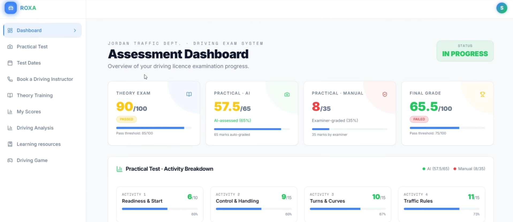
  
</div>

<div align="center">
 
  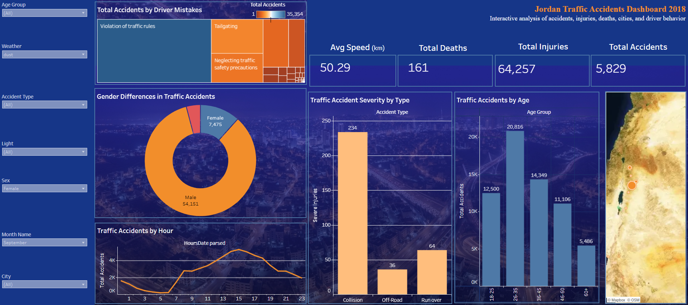
</div>

<div align="center">
  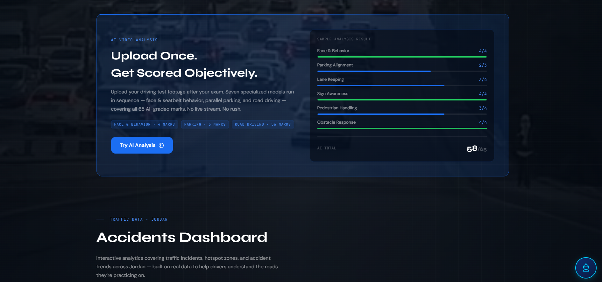
  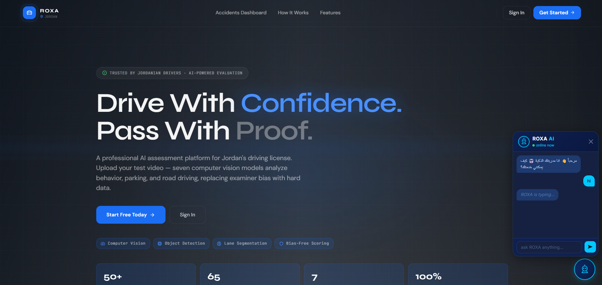
 
  
</div>

<div align="center">
  

  
  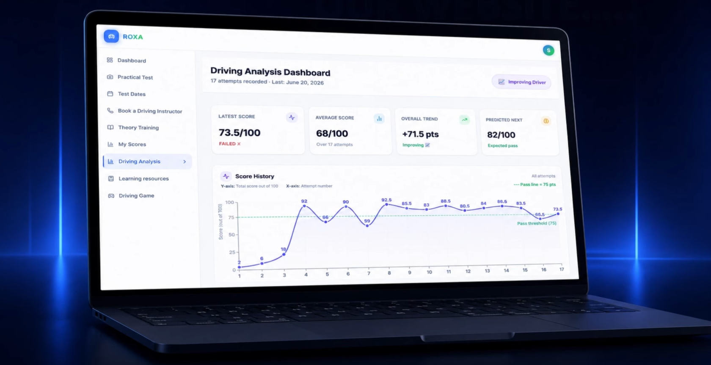
</div>

---

## 🧠 AI Architecture

DriveSkills uses a **multi-model architecture** instead of one large model, since road driving, parking, and in-cabin driver behavior are visually different computer vision tasks.

| API                        | Models Used                            | Classes / Task                                     |
| -------------------------- | -------------------------------------- | -------------------------------------------------- |
| **Road Analysis API**      | YOLOv8n + Custom YOLOv8n + YOLOv8n-seg | Traffic objects, road signs, and lane segmentation |
| **Parking Evaluation API** | Car detection + Custom YOLOv8n         | Vehicle alignment and stability relative to cones  |
| **Driver Monitoring API**  | YOLOv8 + EfficientNetB3                | Driver behavior and seatbelt classification        |

### Road Analysis

The Road Analysis API evaluates driving behavior using object detection and lane segmentation models.

The system detects relevant road elements such as:

* Cars
* People
* Traffic lights
* Stop signs
* Crosswalks
* Speed bumps
* No-entry signs
* Road lanes

### Parking Evaluation

The Parking Evaluation API analyzes the vehicle's position and alignment relative to parking cones and evaluates parking performance.

### Driver Monitoring

The Driver Monitoring API analyzes driver behavior inside the vehicle and detects behaviors such as:

* Mobile phone usage
* Drowsiness
* Other unsafe driving behaviors
* Seatbelt usage

The system combines YOLO-based behavior detection with an EfficientNetB3 classifier for seatbelt classification.

---

## 📊 Model Performance

| Model                     | Precision | Recall | mAP@50 | mAP@50-95 |
| ------------------------- | --------: | -----: | -----: | --------: |
| Road Signs Detection      |     0.952 |  0.931 |  0.974 |     0.772 |
| Lane Segmentation         |     0.980 |  0.973 |  0.986 |     0.901 |
| Cone Detection            |     0.862 |  0.797 |  0.857 |     0.507 |
| Driver Behavior Detection |     0.959 |  0.964 |  0.976 |     0.777 |

### Seatbelt Classification

| Model          | Accuracy | Precision | Recall |  AUC |
| -------------- | -------: | --------: | -----: | ---: |
| EfficientNetB3 |     0.74 |      0.82 |   0.76 | 0.81 |

The models were adapted to the Jordanian driving context using a combination of publicly available datasets and locally collected Jordanian street footage.

---

## 🧮 Scoring System

The practical examination combines automated AI analysis with manual examiner evaluation.

```text
Road Analysis              → 56 marks
Parking Evaluation         →  5 marks
Driver Monitoring          →  4 marks
Manual Examiner Evaluation → 35 marks
                              ───────
                              100 marks
```

The final score is calculated from:

```text
AI Score      = 65%
Examiner Score = 35%

Final Score = AI Score + Examiner Score
```

This approach is designed to support the examiner rather than replace human judgment.

---

## 🛠️ Tech Stack

**Frontend**

* Next.js
* React
* TypeScript
* Tailwind CSS

**Backend / Database**

* Supabase
* PostgreSQL
* Supabase Authentication

**AI / Computer Vision**

* YOLOv8
* Ultralytics
* TensorFlow
* Keras
* EfficientNetB3

**AI Serving**

* Hugging Face Spaces
* Gradio Client

**Deployment**

* Vercel
* Hugging Face Spaces

---

## 🏗️ System Architecture

```text
                         ┌──────────────────┐
                         │       User       │
                         └────────┬─────────┘
                                  │
                                  ▼
                         ┌──────────────────┐
                         │   Next.js Web    │
                         │      App         │
                         └────────┬─────────┘
                                  │
                     ┌────────────┴────────────┐
                     │                         │
                     ▼                         ▼
              ┌─────────────┐          ┌──────────────┐
              │  Supabase   │          │  AI APIs     │
              │ Auth + DB   │          │ Hugging Face │
              └─────────────┘          └──────┬───────┘
                                              │
                         ┌────────────────────┼────────────────────┐
                         │                    │                    │
                         ▼                    ▼                    ▼
                  Road Analysis       Parking Evaluation    Driver Monitoring
                         │                    │                    │
                         └────────────────────┼────────────────────┘
                                              │
                                              ▼
                                      Score Calculation
                                              │
                                              ▼
                                      Final Exam Result
```

---

## 📁 Project Structure

```text
app/
├── dashboard/              → Candidate dashboard
├── practical-test/         → Video upload and AI evaluation
├── game/                   → Educational driving game
├── chatbot/                → Chatbot assistant
└── instructors/            → Theory instructors section

components/                 → Reusable React components

lib/
├── supabase/               → Supabase configuration
└── api/                    → AI API integration

scripts/                    → Database and SQL scripts
```

---

## 🚀 Getting Started

### Prerequisites

* Node.js
* npm
* A Supabase project
* Supabase URL and anonymous key

### Installation

Clone the repository:

```bash
git clone https://github.com/ShahdNazzal/DriveSkills.git
cd DriveSkills
```

Install dependencies:

```bash
npm install
```

### Environment Variables

Create a `.env.local` file:

```env
NEXT_PUBLIC_SUPABASE_URL=your_supabase_project_url
NEXT_PUBLIC_SUPABASE_ANON_KEY=your_supabase_anon_key
```

### Run Locally

```bash
npm run dev
```

The application will be available at:

```text
http://localhost:3000
```

### Production Build

```bash
npm run build
npm start
```

---

## 🤖 AI APIs

The project uses separate AI services for the three main computer vision tasks.

### Road Analysis

https://huggingface.co/spaces/shahednazzal/road_model

### Parking Evaluation

https://huggingface.co/spaces/shahednazzal/parking

### Driver Behavior & Seatbelt

https://huggingface.co/spaces/taimaa47/behavior-seatbelt

The Next.js application communicates with the deployed AI services through the **Gradio Client**.

---

## ⚠️ Limitations

* The system analyzes uploaded videos rather than live video streams.
* AI performance depends on video quality, camera angle, lighting, and visibility.
* The platform is not currently integrated with official government examination systems.
* AI results are intended to support the examiner rather than replace human judgment.
* The system requires an internet connection for cloud-based services and AI APIs.

---

## 🔮 Future Work

* Real-time multi-camera driving analysis
* Mobile application for examiners
* Larger Jordanian-specific datasets
* Improved model performance through additional local training data
* Real-time examiner assistance
* Integration with official examination systems
* Advanced analytics and examination reports

---

## 👥 Team

**Graduation Project — Yarmouk University**

Developed by a **team of 4 members** as part of the Data Science & Artificial Intelligence program.

---

## 📄 License

This project was developed for educational and academic purposes as a graduation project.
